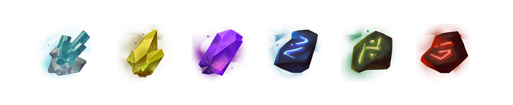
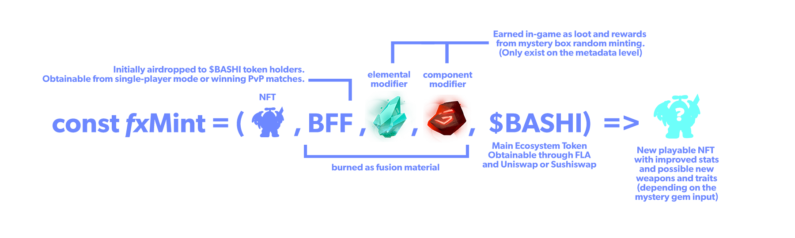

# BFF & Bashi Minting

### A Two-Pronged Approach to GameFi Innovation

Unlike most games where the generation of new in-game unit NFTs are done via breeding two parent NFTs, Bashi NFT generation involves a more <mark style="color:purple;">**programmable**</mark> approach while maintaining a crucial <mark style="color:purple;">**luck-of-the-draw**</mark> factor<mark style="color:purple;">**.**</mark> We want users to have the excitement in anticipation to the new wonders that the Bashiverse will have in-stored for them on a daily basis.

### Bashi Fusion Fuel Unit <mark style="color:purple;">BFF</mark> Fair Launch

BashiVerse will have its own unique method(s) of generating new Bashi NFTs called “Fusion Minting” designed to assist players in the game’s progression. The Bashi Fusion Warp Gate is the primary mechanism that powers the minting of new Bashi units using BFF tokens.

Following the game’s beta release, there will be an initial airdrop allocation to $BASHI holders and stakers in X amounts of <mark style="color:purple;">**BFF**</mark> proportional to factors such as $BASHI held and staking duration and ecosystem participation i.e. game alpha testing, voting, and Bashi NFT interactions.

Team treasury will bootstrap the initial liquidity pools for BFF tokens and will not have any initial allocation. BFF fair launch will be completely driven by BashiVerse ecosystem activities and transactions.

### Mystery Box RNG Minting

Similar to acquiring booster packs for cards in order to build a stronger deck, users may exchange X amount $BASHI token for a mystery box containing 2 randomly generated Bashi NFTs plus 2 random in-game power gems usable in Solo player as powerups or as fusion minting material (similar to crafting materials).

### Fusion Minting

Fusion minting allows for combining gems(in-game loot items) with an existing Bashi NFT(s) you own. Depending on the gems, this process generates a new Bashi NFT with increased stats tier and a new randomly generated weapon/back/helmet "gene" or trait (if the user includes the specific gem associated with that gene or trait). The new Bashi's elemental typing is determined by the elemental gem. The power gem determines stats tier increase. The required BFF tokens and gems are burnt in the process.

\*\*\[TODO buying booster packs or loot boxes that mint 2 random Bashis and 2 random in-game power gems.]
