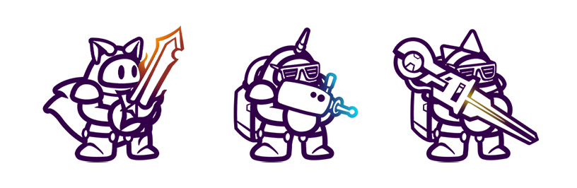

# Bashi

Each Bashi represents an indivisible, 1 of a kind NFT that is <mark style="color:purple;">**playable,**</mark> <mark style="color:purple;">**interactable,**</mark> and [<mark style="color:purple;background-color:purple;">**scalable**</mark>](bashi-leveling-and-scaling.md) <mark style="color:purple;">****</mark> in the BashiVerse. A galaxy of uniquely crafted Bashis where each trait or component serves a special purpose on its own i.e. elemental typing, attack damage, defense, stats, auras, and active abilities collectively fused into extraordinary collectibles that their owners can use to traverse through the game, raid, and duke it out in action-packed skirmishes to earn loot and precious BVX tokens.

### NFT Launch

We do not plan to have an initial offering of Bashi NFTs or minting sale as we strongly advise against the community from buying any potential imposter launches. The idea of selling useless .jpgs simply does not sit well with us and we've been as adamant against it during the previous NFT hype cycle as we will ever be regardless of market conditions.

We have a planned airdrop of randomly generated Bashi NFT(s) to all holders with at least 1337 BVX tokens nearing the game's beta release as a more organic approach to launching our unique Bashi NFTs. We are carefully finalizing each of the components that would make up what's looking to be a 100 million+ possible unique variation of Bashi NFT on the base layer on chain as well as near infinity when coupled with their in-game functions on the metadata level.
