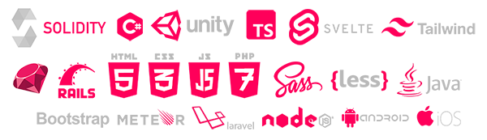

# About Us

We are software and indie-game developers who spent our entire childhood summers playing and nerding out to the likes of Diablo, Broodwar, WoW, Dota, Magic, Yugioh, Pokemon, and Hearthstone just to name a few. We have throughout our development careers taken on projects collectively under [<mark style="color:purple;">**Outer Heaven Foundation**</mark> ](https://www.outerheaven.foundation)and have individually worked with countless brands and companies in the past including Porsche, Google, and Steam games. We occasionally mod and develop standalone video games as an indie studio. Our tech stack includes an ever-growing kit of backend and frontend frameworks / libraries along with Adobe suite in our SaaS and creative capabilities.

### Jack / BigBoss / Bashiverse.eth

CTO - Web 3 Solidity Developer / Full Stack / Unity / C# (former work contributions: Porsche, Google, Steam)

### 0xJuggernaut / Yunero.eth

Creative Director - Frontend Developer / Game Designer / Story Writer / Adobe (former work contributions: Steam, Alchemist, GenieXYZ / Cross Asset Swap)

### Ethen / Ethen.eth

CEO / Advisor - Ecosystem Mastermind (former work contributions: Alchemist / Crucible / mistX / Copperlaunch)
